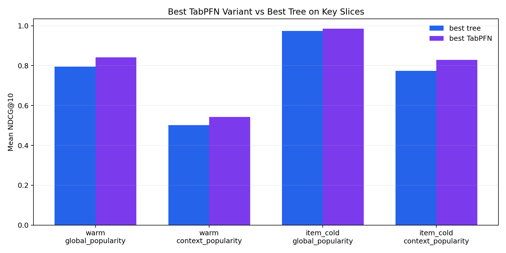
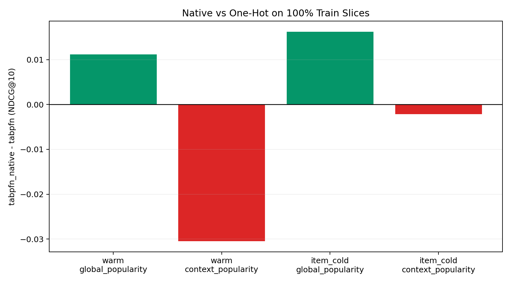
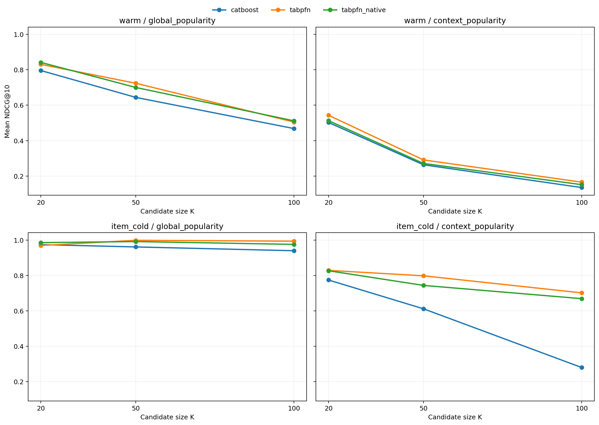

# What If Your Recommender Already Has Candidates, But Not Enough Data to Rank Them Well?

*Draft for a Medium-style post*

If you work on recommendations, you have probably seen this pattern:

- In e-commerce, you already have 20 candidate products for a shopper. The hard part is ranking them well when you only have limited data or many new items.
- In media, you already have a shortlist of movies or shows to recommend. The challenge is reranking that shortlist when feedback is sparse and metadata matters.

That distinction matters.

This project is about **reranking**, not retrieval. We assume you already have a candidate set from something simple and useful:

- popularity
- metadata filters
- a retrieval model
- heuristics or business rules

The question is what comes next:

> How do you evaluate and improve ranking quality when you have a small candidate set, limited interaction data, and a lot of cold-start pain?

That is the gap [`recpfn`](../README.md) is trying to fill.

## The real problem

Many teams can generate candidates. Fewer teams have a clean, reproducible way to answer questions like:

- Does a learned reranker beat popularity on our shortlist?
- Does cold-start change which model wins?
- Do we need tree models, or can TabPFN help here?
- Does categorical representation matter?
- What happens when we only have 10% or 20% of the data we wish we had?

Most recommender tooling is oriented toward mature, large-scale setups. That is useful, but it leaves a gap for smaller teams and metadata-heavy domains that need a faster offline experimentation loop.

That is where this library is useful today.

## What the OSS package is

`recpfn` is currently best understood as a **benchmark-first candidate reranking toolkit**.

It uses a simple canonical input shape:

- `users`
- `items`
- `interactions`
- `candidates`

From there, it supports:

- warm and item-cold evaluation
- `global_popularity` and `context_popularity` candidate protocols
- pointwise and pairwise ranking paths
- baselines and model adapters for:
  - `popularity`
  - `recent_popularity`
  - `xgboost`
  - `catboost`
  - `tabpfn`
  - `tabpfn_native`

And it gives you:

- ranking metrics
- benchmark tables
- figures
- reproducible experiment artifacts

The maturity level matters too:

- this is good for **offline experimentation and benchmarking**
- it is **not yet** positioned as a production-serving reranking library

That is an important part of the value proposition. If you already have a candidate source and want to learn something quickly and honestly about reranking, this is useful now. If you need a full end-to-end recommender platform, it is not that.

## How a practitioner would use it

The practical workflow is simple.

Imagine you already have candidates from:

- popularity
- retrieval
- content filters
- business rules

You want to know:

- whether a learned reranker helps
- whether cold-start is where it helps most
- whether TabPFN does anything interesting relative to trees
- whether representation choices around categoricals change the outcome

The workflow looks like this:

1. Export canonical tables for `users`, `items`, `interactions`, and `candidates`.
2. Build candidate sets and features in a consistent way.
3. Run warm and item-cold evaluation.
4. Compare `xgboost`, `catboost`, `tabpfn`, and `tabpfn_native`.
5. Inspect which model wins in *your* regime rather than guessing from generic recommender lore.

The current CLI is intentionally simple:

```bash
python -m recpfn.cli \
  --dataset movielens_100k \
  --split warm \
  --protocols global_popularity context_popularity \
  --pointwise-models xgboost catboost tabpfn tabpfn_native \
  --max-train-queries 100 \
  --max-test-queries 100
```

That is the right mental model for the package right now:

> not "deploy a recommender in one command"
>
> but "run a disciplined reranking experiment without building a giant recsys stack"

## What we found in Phase 2

The strongest evidence in the repo today comes from the tracked Phase 2 pointwise bundle in [`paper/phase2_pointwise`](./phase2_pointwise).

The headline result is straightforward:

> On the 4 key MovieLens pointwise slices at 100% train, `K=20`, and 3 seeds, a TabPFN variant beat the best tree baseline every time.

Here is the compact view:

| Slice | Best tree | Best TabPFN variant |
| --- | --- | --- |
| `warm / global_popularity` | `catboost 0.7956` | `tabpfn_native 0.8416` |
| `warm / context_popularity` | `catboost 0.5023` | `tabpfn 0.5431` |
| `item_cold / global_popularity` | `catboost 0.9740` | `tabpfn_native 0.9852` |
| `item_cold / context_popularity` | `catboost 0.7741` | `tabpfn 0.8286` |

That does **not** mean "TabPFN wins everywhere."

It means something more useful and more believable:

- pointwise TabPFN is a credible reranking option in small-data and cold-start settings
- the best TabPFN *variant* depends on the ranking regime
- this is strong enough to matter for practitioners who already have candidate sets and metadata

Here is the tracked comparison plot for the main MovieLens slices:



## The low-data story is real

One reason this project still feels useful as an OSS library is that the signal was not limited to one full-data benchmark.

In the low-data ladder:

- on `MovieLens warm / global_popularity`, a TabPFN variant was best at `10%`, `20%`, `50%`, and `100%`
- on `MovieLens item_cold / global_popularity`, `tabpfn_native` beat the one-hot TabPFN path at every train fraction from `10%` to `100%`

That is exactly the kind of question many small teams care about:

> "What should we do before we have enough interaction data to justify a heavier recommender stack?"

The answer from this repo is not "always use TabPFN."

It is:

> "TabPFN is worth testing seriously if your reranking problem is small-data, metadata-heavy, or cold-start-sensitive."

## Why `tabpfn_native` matters

One of the more interesting findings in this project was not just *whether* TabPFN helped, but *how* we fed data to it.

We tested two paths:

- `tabpfn`: the existing one-hot style path
- `tabpfn_native`: a path that preserves mixed-type categorical columns for TabPFN instead of flattening everything the same way

This turned out to matter.

`tabpfn_native` was **not** a universal upgrade. It had positive mean `NDCG@10` deltas on `2/4` key MovieLens slices and negative deltas on the other `2/4`.

Where it helped most:

- `warm / global_popularity`: `+0.0112`
- `item_cold / global_popularity`: `+0.0163`

Where it lost:

- `warm / context_popularity`: `-0.0305`
- `item_cold / context_popularity`: `-0.0022`

It was also faster than the one-hot path across the key slices, with a median runtime ratio of about `0.782x`.

So the right conclusion is:

> `tabpfn_native` is a useful targeted variant, especially for cold-start / global-popularity style reranking, but it is not the new default.

That is actually a valuable practitioner lesson. Representation choices around TabPFN matter, and they matter differently depending on the candidate protocol.

Here is the tracked adapter comparison plot:



## What about larger candidate pools?

A fair criticism of many reranking experiments is that they only work on tiny candidate sets.

We did a targeted `K` sensitivity study on MovieLens:

- `K=20`
- `K=50`
- `K=100`

The good news:

- on `item_cold / global_popularity`, `tabpfn_native` retained `1.006x` of its `K=20` quality at `K=50`
- it still reached `0.9753` at `K=100`

The more honest news:

- warm and context-heavy slices degrade more as `K` grows
- runtime rises sharply as `K` grows, especially for TabPFN

So this is not a claim that TabPFN solves large candidate reranking in general. It is a claim that the small-to-medium candidate reranking regime is interesting enough to justify attention.

Tracked figure:



## Amazon helped, but it is not the main proof

The secondary sanity check in this repo is `Amazon Baby Products`.

The useful part of that result is the `context_popularity` slices:

- `warm`: `tabpfn_native 0.5697` vs `catboost 0.4925`
- `item_cold`: `tabpfn_native 0.9380` vs `catboost 0.5891`

The less useful part is that `global_popularity` is partly saturated there, so it should not drive the main claim.

That is why the public story should stay grounded in MovieLens as the main evidence dataset, with Amazon as directional support rather than the core proof.

## Pairwise is not the story right now

We also explored pairwise ranking.

Conceptually, that makes sense: ranking is naturally a comparison problem, so asking "is item A better than item B?" is appealing.

But the current repo evidence says pairwise should be treated as **secondary**:

- it is much more expensive
- it was not consistently strong enough to become the lead story
- the pointwise evidence is cleaner, stronger, and more actionable

That does **not** make pairwise useless. It just means the honest public recommendation today is:

> If you are using this library now, start with pointwise reranking.

## What the feature ablations suggest

One reason I still see this as more than "just a MovieLens benchmark" is that the feature-group ablations tell a practical story.

On `MovieLens item_cold`, removing interaction history or collapsing to metadata-only causes a large drop for both TabPFN variants. Removing user metadata changes little.

That suggests the current strength is not coming from simplistic demographic shortcuts. It comes more from the interaction-history and item/context structure that survives in these reranking problems.

That is useful for practitioners because it points toward *where* to invest effort:

- candidate generation
- good interaction-history features
- meaningful item metadata

not just "more user demographics"

## So where do we stand as an OSS package?

I would describe the package like this:

**Useful now for:**

- teams that already have candidate sets and want a clean reranking benchmark loop
- practitioners working in small-data or cold-start-heavy settings
- people comparing popularity, trees, and TabPFN without building a full recommender platform first

**Not the right tool for:**

- production retrieval systems
- large-scale serving infrastructure
- end-to-end recommendation stacks
- claims that TabPFN wins universally

That is a narrower story than "new recommender framework," but it is also a more useful and honest one.

## What to take away

If you already have candidates and metadata, and you care about small-data or cold-start reranking, this library is worth trying.

The current evidence supports three practical conclusions:

1. **Pointwise TabPFN is real enough to matter** in the tested reranking regime.
2. **`tabpfn_native` is worth testing**, especially for cold-start / global-popularity reranking.
3. **Pairwise is not the main recommendation** right now.

That is a useful OSS position.

It gives practitioners a reproducible way to answer:

- what works for our shortlist?
- what works when data is scarce?
- what changes when cold-start is the real problem?

And that is a much better reason to use an open-source library than hype.

## Where to look next

If you want the tracked evidence behind this article draft, start here:

- [`paper/phase2_pointwise/decision.md`](./phase2_pointwise/decision.md)
- [`paper/phase2_pointwise/benchmark.md`](./phase2_pointwise/benchmark.md)
- [`paper/phase2_pointwise/aggregated_results.csv`](./phase2_pointwise/aggregated_results.csv)
- [`paper/phase2_pointwise/bootstrap_delta_summary.csv`](./phase2_pointwise/bootstrap_delta_summary.csv)
- [`paper/phase2_pointwise/k_sensitivity_results.csv`](./phase2_pointwise/k_sensitivity_results.csv)
- [`paper/phase2_pointwise/feature_group_ablation.csv`](./phase2_pointwise/feature_group_ablation.csv)

And if you need the preserved raw milestone archive rather than just the summaries:

- [`paper/phase2_pointwise/raw_results_archive_manifest.json`](./phase2_pointwise/raw_results_archive_manifest.json)
